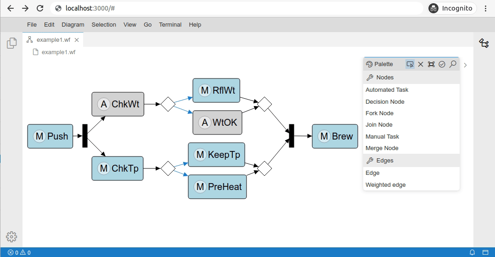

# Eclipse GLSP Examples [](https://ci.eclipse.org/glsp/job/eclipse-glsp/job/glsp-examples/job/master/)

This repository contains code examples that demonstrate how to build diagram editors with the [Graphical Language Server Platform (GLSP)](https://github.com/eclipse-glsp/glsp).
The examples are focused on the integration of GLSP editors with the cloud-based [Eclipse Theia IDE](https://github.com/theia-ide/theia) using the [GLSP Theia integration](https://github.com/eclipse-glsp/glsp-theia-integration) and the Java based [GLSP Server Framework](https://github.com/eclipse-glsp/glsp-server).

Each example is self-contained and provides both, an example diagram client (`glsp-client` directory) and its corresponding GLSP server (`glsp-server` directory).

## Prerequisites

The following libraries/frameworks need to be installed on your system:

-   [Node.js](https://nodejs.org/en/) `>=14.18.0`
-   [Yarn](https://classic.yarnpkg.com/en/docs/install#debian-stable) `>=1.7.0`
-   [Java](https://www.oracle.com/java/technologies/javase-jdk11-downloads.html) `>=11`
-   [Maven](https://maven.apache.org/) `>=3.6.0`

The examples are heavily interwoven with Eclipse Theia, so please also check the [prerequisites of Theia](https://github.com/eclipse-theia/theia/blob/master/doc/Developing.md#prerequisites).

The web-based/client part of the examples has been developed using [Visual Studio Code](https://code.visualstudio.com/) and the server/java part has been developed with the [Eclipse IDE](https://www.eclipse.org/ide/).
However, it's of course also possible to use any other IDE or text editor.

## Examples

-   [Project Templates](project-templates): The best starting point for your own diagram editor project.
    The project templates are available for several combinations of tool platform integrations (Theia, VSCode), source models (JSON, EMF) and servers (Node, Java). Please visit the [GLSP documentation](https://www.eclipse.org/glsp/documentation/gettingstarted/) for more information.

-   [Workflow Example](workflow): A consistent example provided by all GLSP components.
    It implements a simple flow chart diagram editor with different types of nodes and edges.
    The `Workflow Example` is the main example used for development and integrates all GLSP features

    

### VSCode workspaces

To work with the source code and debug the examples in VS Code dedicated VSCode Workspace files for each example are provided.
These workspace include both the `glsp-client` and `glsp-server` sources and offer dedicated launch configurations for debugging purposes.

To open a example workspace simply start a VS Code instance and use the `Open Workspace from File..` entry from the `File` menu.
Then navigate to a example or project template subdirectory (e.g. `workflow`) and open the `*.vscode-workspace` file.

For a smooth development experience we recommend a set of useful VS Code extensions. When a workspace is first opened VS Code will ask you wether you want to install those recommended extensions.
Alternatively, you can also open the `Extension View`(Ctrl + Shift + X) and type `@recommended` into the search field to see the list of `Workspace Recommendations`.

## Building the examples

The server component of each example has to be built using Maven, the client component has to be built using yarn. Convenience scripts to build both components at once are provided.
To build all examples simply execute the following in the repository root:

```bash
yarn build
```

In addition, it is also possible to build each example individually:

```bash
# Build only the workflow example
yarn build:workflow
```

## Running the examples

Each example provides a dedicated Theia web app which can be started from the repository root with `yarn start:<example_name>`:

```bash
   # Start workflow example Theia app
   yarn start:workflow
```

This will launch the example in the browser on [localhost:3000](http://localhost:3000).

> **Note** that each example will be launched at the same port (`3000`).
> Therefore it's currently not possible to launch multiple example Theia apps simultaneously.

## Debugging the examples

Theia applications run in two separate process the `Theia Frontend` and the `Theia Backend` process.
In addition, the GLSP Server runs in a third separated process.
Each process can be debugged individually and the [example workspaces](#vscode-workspaces) provides dedicated debug configurations.

To start debugging open a example workspace and then navigate to the `Run and Debug` view (Ctrl + Shift + D).

Here you can choose between four different debug configurations:

-   `Launch <example-name> Theia Backend (Embedded GLSP Server)`: <br>
    This config can be used to launch the example Theia Backend node process in Debug Mode.
    Breakpoints in the backend source files of the theia integration package (`<example-name>-theia`) will be picked up.
    The backend process includes the source files in `src/node` and `src/common`.
    This launch config will start the GLSP server as embedded process which means you don't have to start the server process manually beforehand.
    However, this also means you won't be able to debug the GLSP Server source code.
-   `Launch <example-name> Theia Backend (External GLSP Server)`<br>
    This config can be used when both the Theia Backend and the GLSP Server process should be debugged.
    It will launch the Theia Backend node process in Debug mode
    but will not start an embedded GLSP server process.
    It expects that the GLSP Server process is already running and has been started externally (e.g. through another VSCode launch config or in the Eclipse IDE).
-   `Launch <example-name> Theia Frontend`<br>
    This config can be used to launch the example Theia Frontend process in Debug Mode and directly debug the sources in VS Code.
    Breakpoints in the frontend source files of the `glsp-client` packages will be picked up. A browser window pointing to [localhost:3000](http://localhost:3000) will be opened automatically.
-   `Launch <example-name> GLSP Server`<br>
    This config can be used to launch the example GLSP server Java process in Debug Mode.
    Breakpoint the Java source files of the `glsp-server` directory will be picked up.
    In order to use this config, the Theia backed has to be launched in `External` server mode.
    This can either be done with the corresponding launch config or, if you are not interested in debugging the Theia backend, it can also be launched in normal mode by executing `yarn start:external` in the `glsp-client` directory.

Naturally the Theia frontend process can also be debugged with the built-in `Debugging Tools` of the browser.
Simply go to [localhost:3000](http://localhost:3000) and open the `Debugging Tools` of your browser.
For instance for Google Chrome the `Debugging Tools` can be open with `F12` or `Ctrl+ Shift + I`.

> **Note** Parts of the server source may be generated from a graph `.ecore` model.
> Adapting this model and regenerating the source code can only be done in the Eclipse IDE because VS Code has currently no Ecore support.

### Debugging the GLSP Server in Eclipse

All example GLSP servers are maven projects which can be imported directly into the Eclipse IDE.
In contrast to the Java support in VS Code, Eclipse also offers Ecore tooling which is required to manipulate or extend the graph Ecore models (e.g. [`workflow-graph.ecore`](workflow/glsp-server/src/main/resources/workflow-graph.ecore).

We recommend to use the [`Eclipse Modeling Tools`](https://www.eclipse.org/downloads/packages/release/2021-12/r/eclipse-modeling-tools) package as it already provides most needed plugins out of the box.
Only the [`M2E` plugin](https://github.com/eclipse-m2e/m2e-core/blob/master/README.md#-installation) has to be installed on top to enable maven support in Eclipse.

Use the file menu to import a `glsp-server` maven project into the Workspace ( File -> Import... -> Maven -> Existing Maven Projects).
The projects also contain a launch configuration (`<ExampleName>ServerLauncher.launch`) to enable debugging via the `Run` menu.

## Integration with other platforms

The general GLSP Client code is separated from the Theia specific glue code and located in a dedicated package with `-glsp` prefix (e.g. `workflow-glsp`).
This package can be easily reused when the package should be integrated with any other platform.
In addition to the Theia integration, GLSP provides the following glue code frameworks:

-   [GLSP VSCode Integration](https://github.com/eclipse-glsp/glsp-vscode-integration)
-   [GLSP Eclipse IDE Integration](https://github.com/eclipse-glsp/glsp-eclipse-integration)

For a reference implementation of a example specific glue code package please checkout the `project templates`.

## More information

For more information, please visit the [Eclipse GLSP Umbrella repository](https://github.com/eclipse-glsp/glsp) and the [Eclipse GLSP Website](https://www.eclipse.org/glsp/).
If you have questions, please raise them in the [discussions](https://github.com/eclipse-glsp/glsp/discussions) and have a look at our [communication and support options](https://www.eclipse.org/glsp/contact/).
