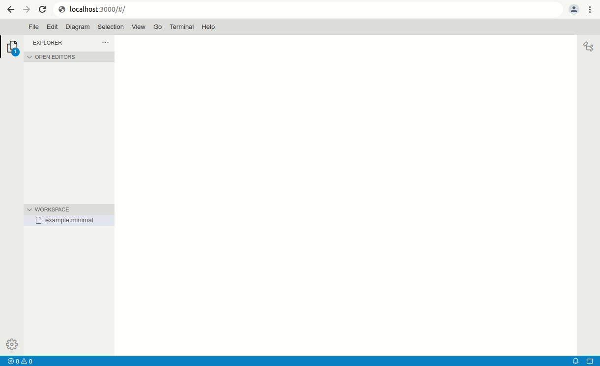

# Eclipse GLSP - Minimal Example

This example shows the integration of a very basic GLSP Diagram Editor into a Theia browser application. This demonstrates the core concepts and basic client-server integration into Theia.

## Prerequisites

The following libraries/frameworks need to be installed on your system:

-   [Node.js](https://nodejs.org/en/) `>= 12.14.1 AND < 13`
-   [Yarn](https://classic.yarnpkg.com/en/docs/install#debian-stable) `>=1.7.0`
-   [Java](https://www.oracle.com/java/technologies/javase-jdk11-downloads.html) `>=11`
-   [Maven](https://maven.apache.org/) `>=3.6.0`

The examples are heavily interweaved with Eclipse Theia, so please also check the [prerequisites of Theia](https://github.com/eclipse-theia/theia/blob/master/doc/Developing.md#prerequisites).

The web-based/client part of the examples has been developed using [Visual Studio Code](https://code.visualstudio.com/) and the server/java part has been developed with the [Eclipse IDE](https://www.eclipse.org/ide/). However, it's of course also possible to use any other IDE or text editor.

## Building the example

The server component of the minimal example has to be built using Maven, the client component has to be built using yarn. This can be done via CLI:

    cd glsp-server && mvn clean verify && cd ..
    cd glsp-client && yarn && cd minimal-theia && yarn copy:server && cd ../..

## Running the example

To start the Theia web app with the integrated minimal example simply navigate to
the client directory :

    cd glsp-client

and then execute:

    yarn start

This will launch the example in the browser on [localhost:3000](http://localhost:3000).
